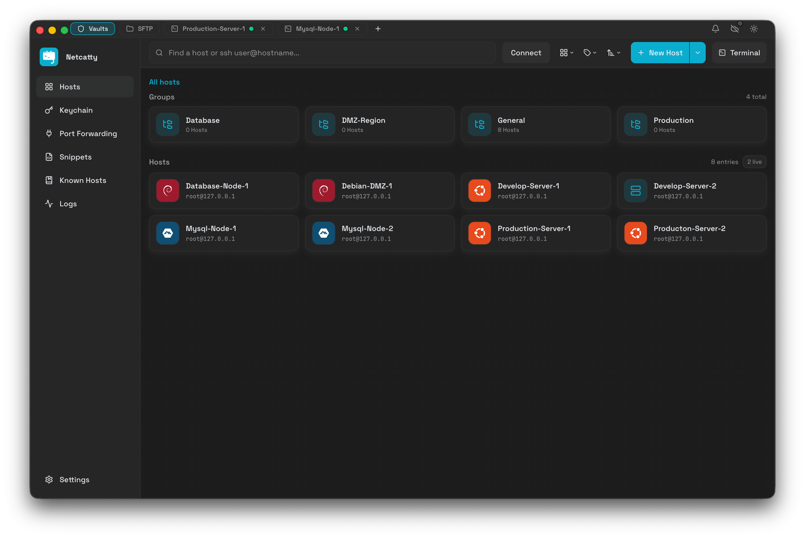
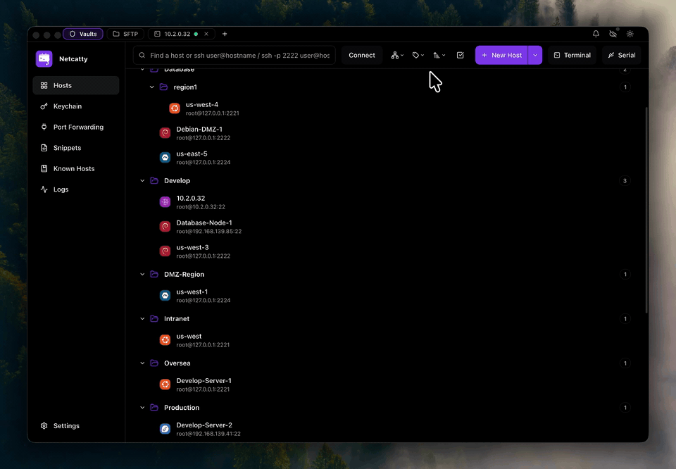
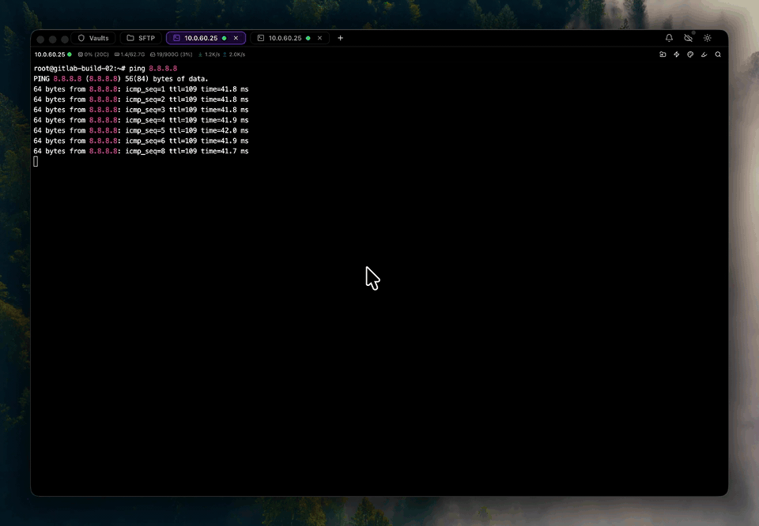
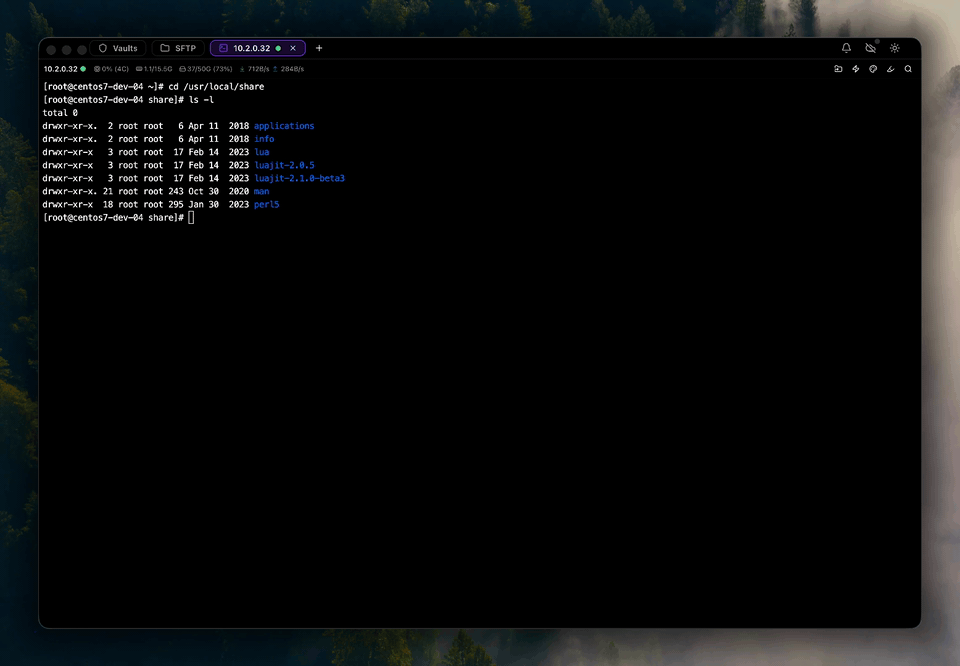
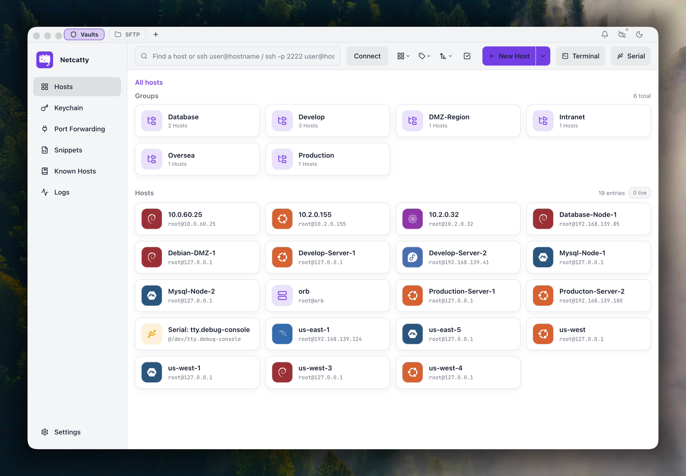
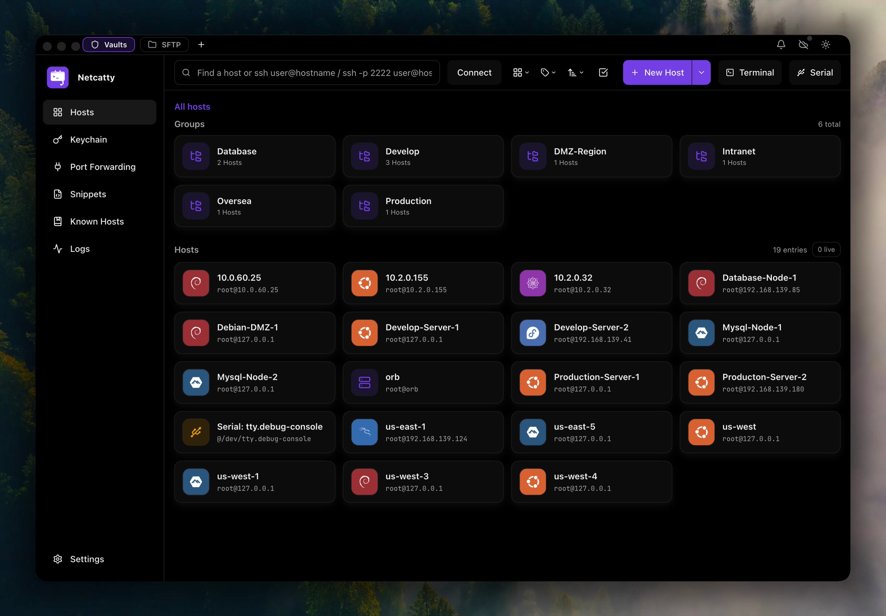
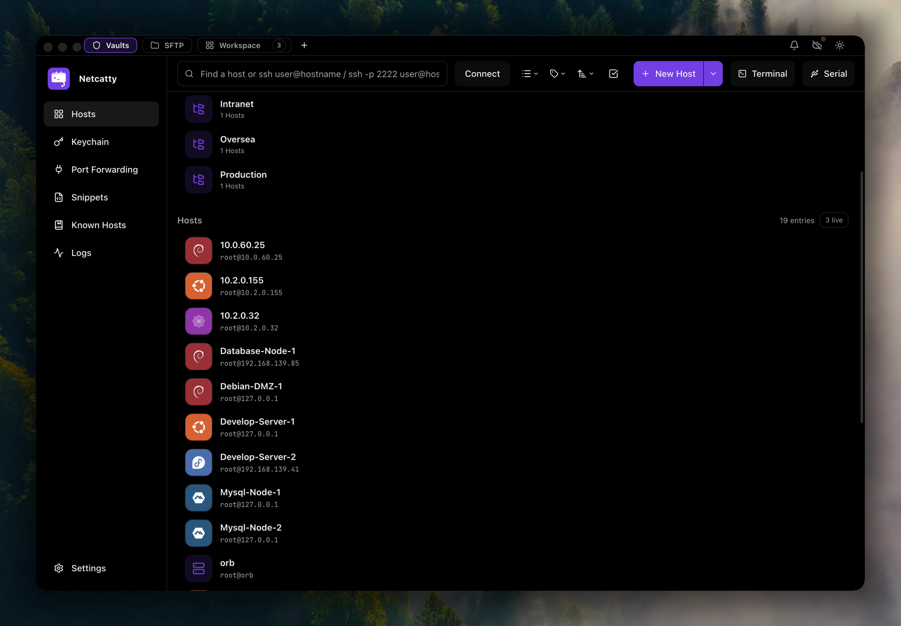
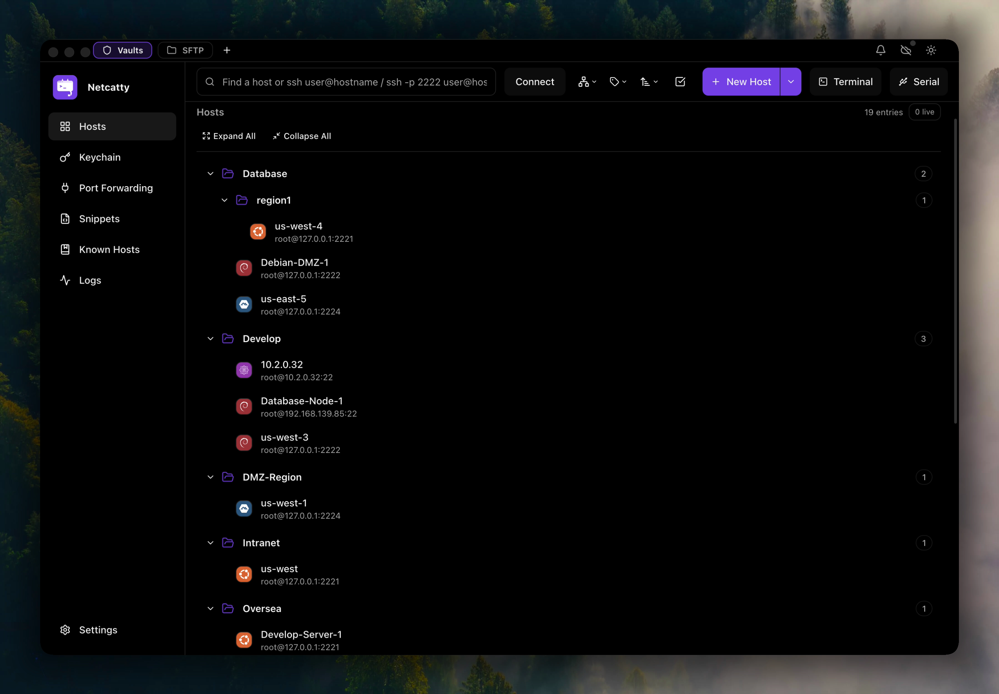
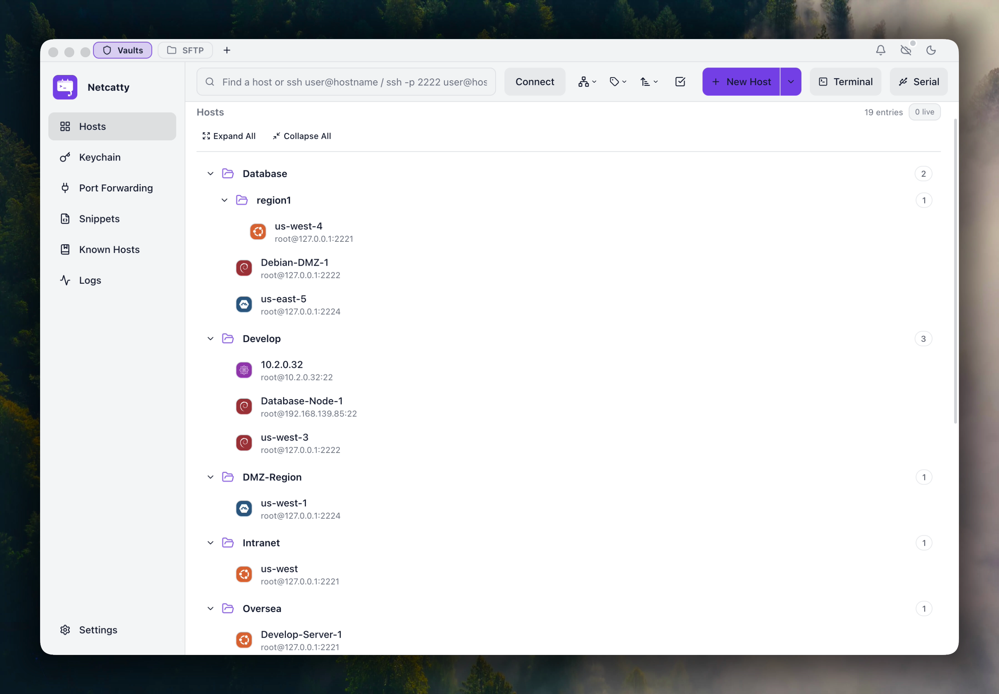
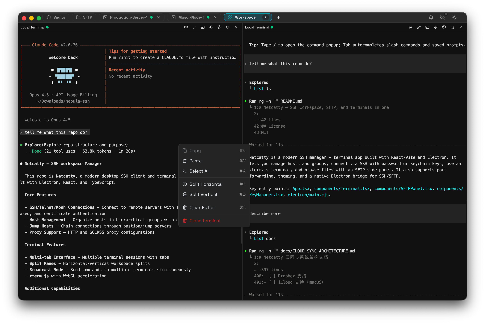

<h1 align="center">Netcatty</h1>

<p align="center">
  <strong>Modern SSH Client, SFTP Browser & Terminal Manager</strong><br/>
  <a href="https://netcatty.app"><strong>netcatty.app</strong></a>
</p>

<p align="center">
  A beautiful, feature-rich SSH workspace built with Electron, React, and xterm.js.<br/>
  Split terminals, Vault views, SFTP workflows, custom themes, and keyword highlighting — all in one.
</p>

<p align="center">
  <a href="https://github.com/binaricat/Netcatty/releases/latest"><strong>Download Latest Release</strong></a>
  &nbsp;·&nbsp;
  <a href="LICENSE"><strong>GPL-3.0 License</strong></a>
  &nbsp;·&nbsp;
  <a href="https://ko-fi.com/binaricat"><strong>Support on Ko-fi</strong></a>
</p>

<p align="center">
  <a href="./README.md">English</a> · <a href="./README.zh-CN.md">简体中文</a> · <a href="./README.ja-JP.md">日本語</a>
</p>

---

[](screenshots/main-window-dark.png)

---

# Contents <!-- omit in toc -->

- [What is Netcatty](#what-is-netcatty)
- [Why Netcatty](#why-netcatty)
- [Features](#features)
- [Demos](#demos)
- [Screenshots](#screenshots)
  - [Main Window](#main-window)
  - [Vault Views](#vault-views)
  - [Split Terminals](#split-terminals)
- [Supported Distros](#supported-distros)
- [Getting Started](#getting-started)
- [Build & Package](#build--package)
- [Tech Stack](#tech-stack)
- [Contributing](#contributing)
- [License](#license)

---

<a name="what-is-netcatty"></a>
# What is Netcatty

**Netcatty** is a modern SSH client and terminal manager for macOS, Windows, and Linux, designed for developers, sysadmins, and DevOps engineers who need to manage multiple remote servers efficiently.

- **Netcatty is** an alternative to PuTTY, Termius, SecureCRT, and macOS Terminal.app for SSH connections
- **Netcatty is** a powerful SFTP client with dual-pane file browser
- **Netcatty is** a terminal workspace with split panes, tabs, and session management
- **Netcatty supports** SSH, local terminal, Telnet, Mosh, and Serial connections (when available)
- **Netcatty is not** a shell replacement — it connects to shells via SSH/Telnet/Mosh or local/serial sessions

---

<a name="why-netcatty"></a>
# Why Netcatty

If you regularly work with a fleet of servers, Netcatty is built for speed and flow:

- **Workspace-first** — split panes + tabs + session restore for “always-on” workflows
- **Vault organization** — grid/list/tree views with fast search and drag-friendly workflows
- **Serious SFTP** — built-in editor + drag & drop + smooth file operations

---

<a name="features"></a>
# Features

### 🗂️ Vault
- **Multiple views** — grid / list / tree
- **Fast search** — locate hosts and groups quickly

### 🖥️ Terminal Workspaces
- **Split panes** — horizontal and vertical splits for multi-tasking
- **Session management** — run multiple connections side-by-side

### 📁 SFTP + Built-in Editor
- **File workflows** — drag & drop uploads/downloads
- **Edit in place** — built-in editor for quick changes

### 🎨 Personalization
- **Custom themes** — tune the app appearance to your taste
- **Keyword highlighting** — customize highlight rules for terminal output

---

<a name="demos"></a>
# Demos

GIF previews (stored in `screenshots/gifs/`), rendered inline on GitHub:

### Vault views: grid / list / tree
Switch between different Vault views to match your workflow: overview in grid, dense scanning in list, and hierarchical navigation in tree.



### Split terminals + session management
Work in multiple sessions at once with split panes. Keep related tasks side-by-side and reduce context switching.



### SFTP: drag & drop + built-in editor
Move files with drag & drop, then edit quickly using the built-in editor without leaving the app.


### Drag file upload
Drop files into the app to kick off uploads without hunting through dialogs.



### Custom themes
Make Netcatty yours: customize themes and UI appearance.


### Keyword highlighting
Highlight important terminal output so errors, warnings, and key events stand out at a glance.


---

<a name="screenshots"></a>
# Screenshots

<a name="main-window"></a>
## Main Window

The main window is designed for long-running SSH workflows: quick access to sessions, navigation, and core tools in one place.




<a name="vault-views"></a>
## Vault Views

Organize and navigate your hosts using the view that best fits the moment: grid for overview, list for scanning, tree for structure.









<a name="split-terminals"></a>
## Split Terminals

Split panes help you monitor multiple servers/services at the same time (deploy + logs + metrics) without juggling windows.



---

<a name="supported-distros"></a>
# Supported Distros

Netcatty automatically detects and displays OS icons for connected hosts:

<p align="center">
  
  
  
  
  
  
  
  
  
  
  
  
</p>

<a name="getting-started"></a>
# Getting Started

### Download

Download the latest release for your platform from [GitHub Releases](https://github.com/binaricat/Netcatty/releases/latest).

| OS | Support |
| :--- | :--- |
| **macOS** | Universal (x64 / arm64) |
| **Windows** | x64 / arm64 |
| **Linux** | x64 / arm64 |

Or browse all releases at [GitHub Releases](https://github.com/binaricat/Netcatty/releases).

> **⚠️ macOS Users:** Since the app is not code-signed, macOS Gatekeeper will block it. After downloading, run this command to remove the quarantine attribute:
> ```bash
> xattr -cr /Applications/Netcatty.app
> ```
> Or right-click the app → Open → Click "Open" in the dialog.

### Prerequisites
- Node.js 18+ and npm
- macOS, Windows 10+, or Linux

### Development

```bash
# Clone the repository
git clone https://github.com/binaricat/Netcatty.git
cd Netcatty

# Install dependencies
npm install

# Start development mode (Vite + Electron)
npm run dev
```

### Project Structure

```
├── App.tsx                 # Main React application
├── components/             # React components
│   ├── Terminal.tsx        # Terminal component
│   ├── SftpView.tsx        # SFTP browser
│   ├── VaultView.tsx       # Host management
│   ├── KeyManager.tsx      # SSH key management
│   └── ...
├── application/            # State management & i18n
├── domain/                 # Domain models & logic
├── infrastructure/         # Services & adapters
├── electron/               # Electron main process
│   ├── main.cjs            # Main entry
│   └── bridges/            # IPC bridges
└── public/                 # Static assets & icons
```

---

<a name="build--package"></a>
# Build & Package

```bash
# Build for production
npm run build

# Package for current platform
npm run pack

# Package for specific platforms
npm run pack:mac     # macOS (DMG + ZIP)
npm run pack:win     # Windows (NSIS installer)
npm run pack:linux   # Linux (AppImage + DEB + RPM)
```

---

<a name="tech-stack"></a>
# Tech Stack

| Category | Technology |
|----------|------------|
| Framework | Electron 40 |
| Frontend | React 19, TypeScript |
| Build Tool | Vite 7 |
| Terminal | xterm.js 5 |
| Styling | Tailwind CSS 4 |
| SSH/SFTP | ssh2, ssh2-sftp-client |
| PTY | node-pty |
| Icons | Lucide React |

---

<a name="contributing"></a>
# Contributing

Contributions are welcome! Please feel free to submit a Pull Request.

1. Fork the repository
2. Create your feature branch (`git checkout -b feature/amazing-feature`)
3. Commit your changes (`git commit -m 'Add some amazing feature'`)
4. Push to the branch (`git push origin feature/amazing-feature`)
5. Open a Pull Request

See [agents.md](agents.md) for architecture overview and coding conventions.

---

<a name="contributors"></a>
# Contributors

Thanks to all the people who contribute!

See: https://github.com/binaricat/Netcatty/graphs/contributors

---

<a name="license"></a>
# License

This project is licensed under the **GPL-3.0 License** - see the [LICENSE](LICENSE) file for details.

---

<p align="center">
  Made with ❤️ by <a href="https://ko-fi.com/binaricat">binaricat</a>
</p>
