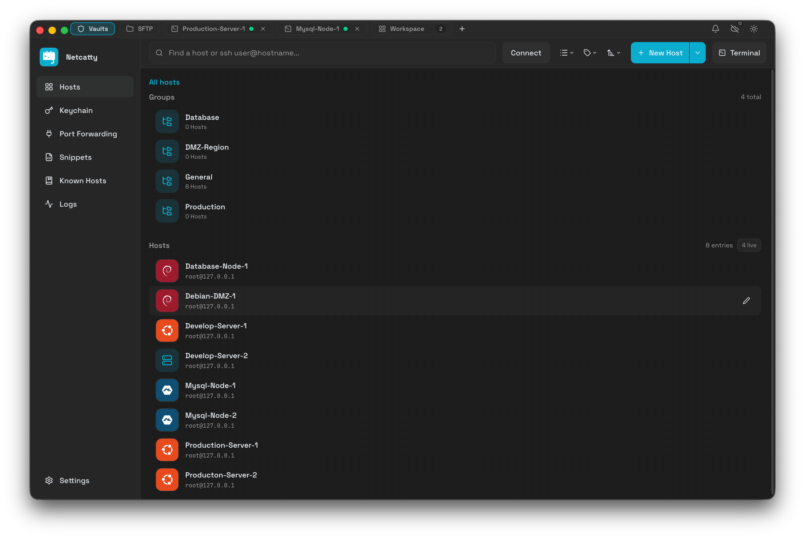
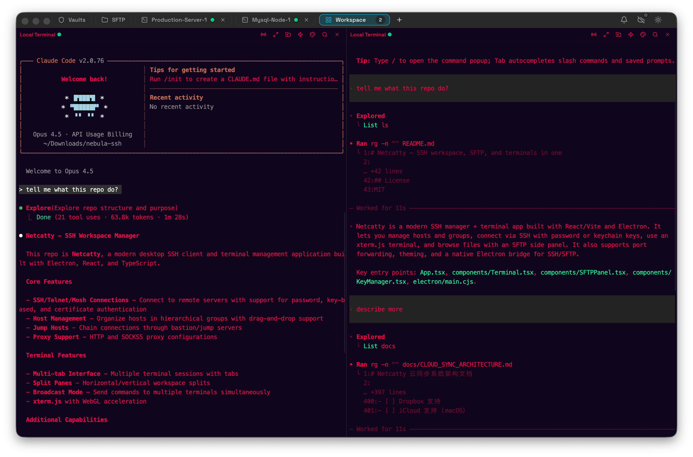
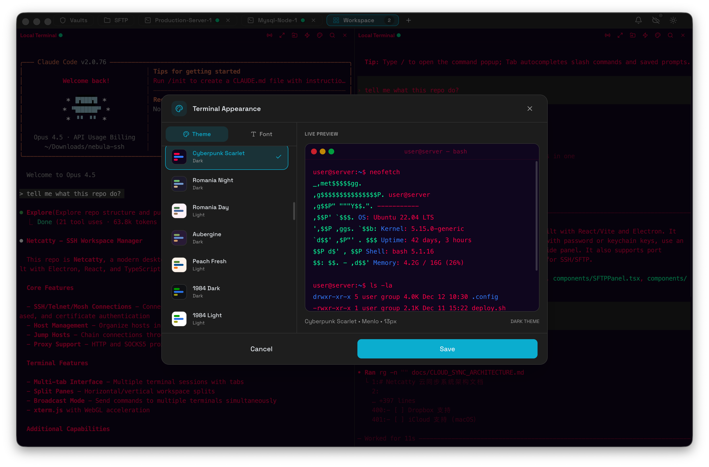
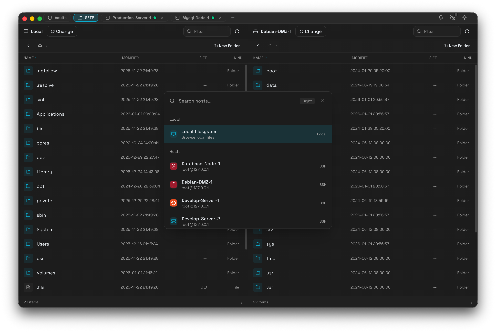
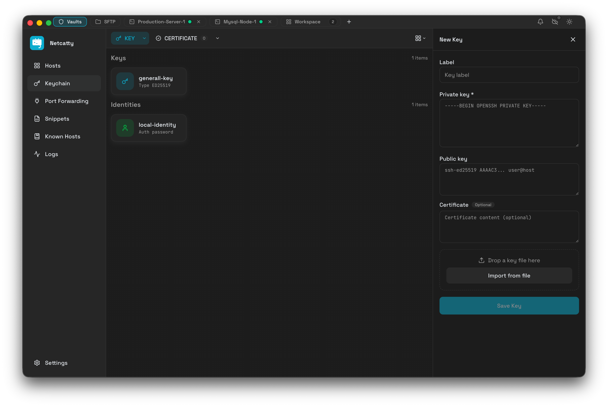
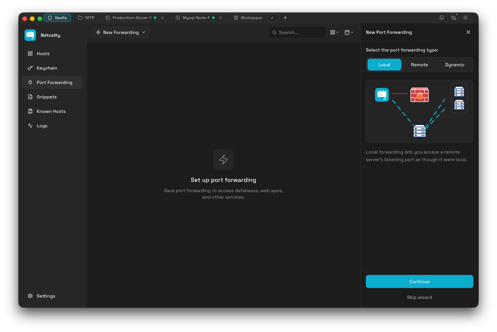
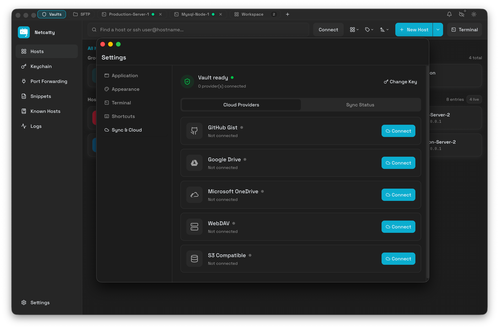
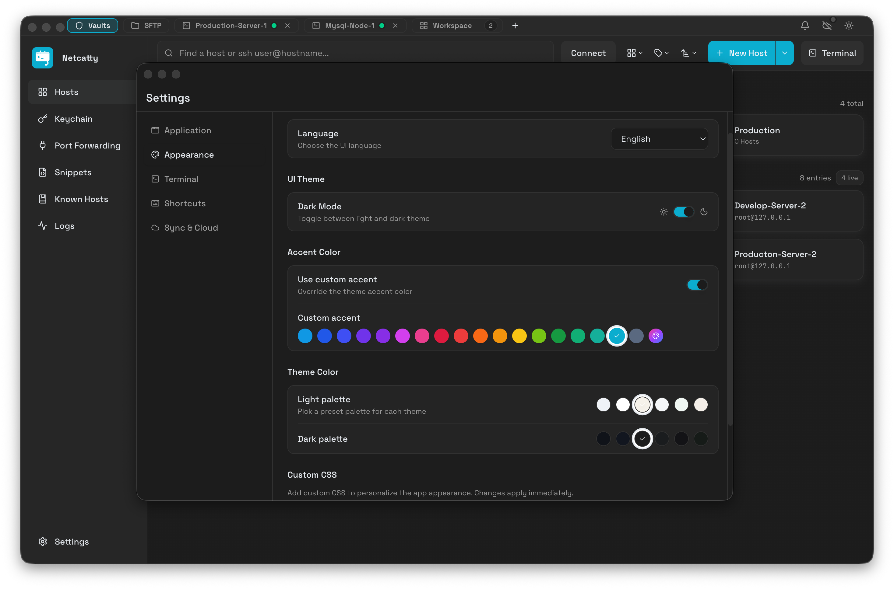

  

<h1 align="center">Netcatty</h1>

  <strong>Modern SSH Client, SFTP Browser & Terminal Manager</strong>

  A beautiful, feature-rich SSH workspace built with Electron, React, and xterm.js. 
  Host management, split terminals, SFTP, port forwarding, and cloud sync — all in one.

  
  &nbsp;
  
  &nbsp;
  

  

---

---

# Contents <!-- omit in toc -->

- [What is Netcatty](#what-is-netcatty)
- [Features](#features)
- [Screenshots](#screenshots)
  - [Host Management](#host-management)
  - [Terminal](#terminal)
  - [SFTP](#sftp)
  - [Keychain](#keychain)
  - [Port Forwarding](#port-forwarding)
  - [Cloud Sync](#cloud-sync)
  - [Themes & Customization](#themes--customization)
- [Supported Distros](#supported-distros)
- [Getting Started](#getting-started)
- [Build & Package](#build--package)
- [Tech Stack](#tech-stack)
- [Contributing](#contributing)
- [License](#license)

---

# What is Netcatty

**Netcatty** is a modern, cross-platform SSH client and terminal manager designed for developers, sysadmins, and DevOps engineers who need to manage multiple remote servers efficiently.

- **Netcatty is** an alternative to PuTTY, Termius, SecureCRT, and macOS Terminal.app for SSH connections
- **Netcatty is** a powerful SFTP client with dual-pane file browser
- **Netcatty is** a terminal workspace with split panes, tabs, and session management
- **Netcatty is not** a shell replacement — it connects to remote shells via SSH/Telnet or local terminals

---

# Features

### 🖥️ Terminal & Sessions
- **xterm.js-based terminal** with GPU-accelerated rendering
- **Split panes** — horizontal and vertical splits for multi-tasking
- **Tab management** — multiple sessions with drag-to-reorder
- **Session persistence** — restore sessions on restart
- **Broadcast mode** — type once, send to multiple terminals

### 🔐 SSH Client
- **SSH2 protocol** with full authentication support
- **Password & key-based authentication**
- **SSH certificates** support
- **Jump hosts / Bastion** — chain through multiple hosts
- **Proxy support** — HTTP CONNECT and SOCKS5 proxies
- **Agent forwarding** — including OpenSSH Agent and Pageant
- **Environment variables** — set custom env vars per host

### 📁 SFTP
- **Dual-pane file browser** — local ↔ remote or remote ↔ remote
- **Drag & drop** file transfers
- **Queue management** for batch transfers
- **Progress tracking** with transfer speed

### 🔑 Keychain
- **Generate SSH keys** — RSA, ECDSA, ED25519
- **Import existing keys** — PEM, OpenSSH formats
- **SSH certificates** support
- **Identity management** — reusable username + auth combinations
- **Export public keys** to remote hosts

### 🔌 Port Forwarding
- **Local forwarding** — expose remote services locally
- **Remote forwarding** — expose local services remotely
- **Dynamic forwarding** — SOCKS5 proxy
- **Visual tunnel management**

### ☁️ Cloud Sync
- **End-to-end encrypted sync** — your data is encrypted before leaving your device
- **Multiple providers** — GitHub Gist, S3-compatible storage, WebDAV, Google Drive, OneDrive
- **Sync hosts, keys, snippets, and settings**

### 🎨 Themes & Customization
- **Light & Dark mode**
- **Custom accent colors**
- **50+ terminal color schemes**
- **Font customization** — JetBrains Mono, Fira Code, and more
- **i18n support** — English, 简体中文, and more

---

# Screenshots

## Host Management

Organize hosts with groups, tags, and powerful search. Drag and drop to reorganize.

| Dark Mode | Light Mode | List View |
|-----------|------------|-----------|
|  |  |  |

## Terminal

Split terminals, customize themes, and run snippets across sessions.

| Split Windows | Theme Customization |
|---------------|---------------------|
|  |  |

## SFTP

Dual-pane SFTP browser with drag-and-drop transfers.

## Keychain

Manage SSH keys, certificates, and identities in one place.

## Port Forwarding

Create and manage SSH tunnels with visual interface.

## Cloud Sync

Sync your configuration securely across devices.

## Themes & Customization

Personalize your workspace with themes, accent colors, and i18n.

---

# Supported Distros

Netcatty automatically detects and displays OS icons for connected hosts:

  
  
  
  
  
  
  
  
  
  
  
  

---

# Getting Started

### Prerequisites
- Node.js 18+ and npm
- macOS, Windows 10+, or Linux

### Development

\`\`\`bash
# Clone the repository
git clone https://github.com/user/netcatty.git
cd netcatty

# Install dependencies
npm install

# Start development mode (Vite + Electron)
npm run dev
\`\`\`

### Project Structure
\`\`\`
├── App.tsx                 # Main React application
├── components/             # React components
│   ├── Terminal.tsx        # Terminal component
│   ├── SftpView.tsx        # SFTP browser
│   ├── VaultView.tsx       # Host management
│   ├── KeyManager.tsx      # SSH key management
│   └── ...
├── application/            # State management & i18n
├── domain/                 # Domain models & logic
├── infrastructure/         # Services & adapters
├── electron/               # Electron main process
│   ├── main.cjs            # Main entry
│   └── bridges/            # IPC bridges
└── public/                 # Static assets & icons
\`\`\`

---

# Build & Package

\`\`\`bash
# Build for production
npm run build

# Package for current platform
npm run pack

# Package for specific platforms
npm run pack:mac     # macOS (DMG + ZIP)
npm run pack:win     # Windows (NSIS installer)
npm run pack:linux   # Linux (AppImage, deb, rpm)
\`\`\`

---

# Tech Stack

| Category | Technology |
|----------|------------|
| Framework | Electron 39 |
| Frontend | React 19, TypeScript |
| Build Tool | Vite 7 |
| Terminal | xterm.js 5 |
| Styling | Tailwind CSS 4 |
| SSH/SFTP | ssh2, ssh2-sftp-client |
| PTY | node-pty |
| Icons | Lucide React |

---

# Contributing

Contributions are welcome! Please feel free to submit a Pull Request.

1. Fork the repository
2. Create your feature branch (\`git checkout -b feature/amazing-feature\`)
3. Commit your changes (\`git commit -m 'Add some amazing feature'\`)
4. Push to the branch (\`git push origin feature/amazing-feature\`)
5. Open a Pull Request

See [agents.md](agents.md) for architecture overview and coding conventions.

---

# License

This project is licensed under the **GPL-3.0 License** - see the [LICENSE](LICENSE) file for details.

---

  Made with ❤️ by <a href="https://ko-fi.com/binaricat">binaricat</a>

